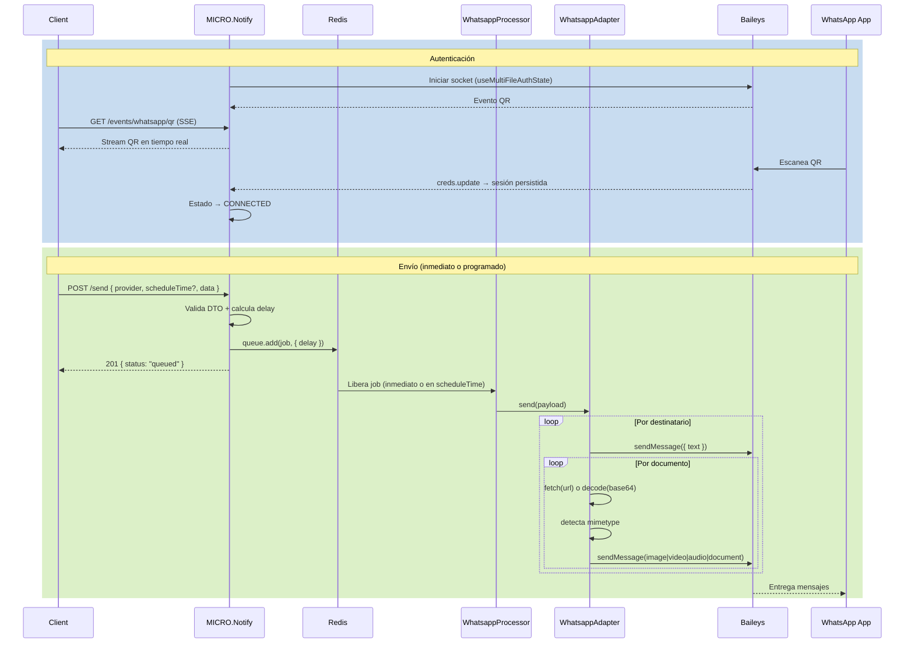

# Flujo de WhatsApp

Este documento describe cómo MICRO.Notify maneja la integración con WhatsApp a través del adaptador `WhatsappAdapter` (Baileys).

---

## 1. Autenticación y Conexión

El microservicio usa [Baileys](https://github.com/WhiskeySockets/Baileys) para conectarse a WhatsApp via protocolo Multi-Device, simulando un dispositivo Web.

1. **Inicialización**: Al levantar el módulo, se verifica si existen credenciales previas en `WHATSAPP_AUTH_DIR`.
2. **Generación de QR**: Si no hay sesión activa, Baileys emite eventos QR que el adaptador propaga vía `ProviderStateService`.
3. **Escucha del QR**:
   - `GET /auth/qr` — página HTML con el QR actual.
   - `GET /events/whatsapp/qr` — stream SSE con rotación en tiempo real (heartbeat cada 15 s).
4. **Vinculación**: Al escanear el QR con WhatsApp móvil, las credenciales se persisten en disco y el estado pasa a **CONNECTED**.
5. **Reconexión automática**: Si la conexión se cierra, el adaptador reintenta con backoff exponencial (`base * 2^n`, máximo `WHATSAPP_RECONNECT_MAX_DELAY_MS`).

---

## 2. Envío de Mensajes

### 2.1 Payload

```jsonc
// POST /send
{
  "provider": "whatsapp",
  "scheduleTime": "2026-03-18T10:00:00.000Z",  // opcional
  "data": {
    "to": ["521234567890"],          // uno o más números
    "message": "Texto del mensaje",  // opcional si hay documents
    "documents": [                   // opcional si hay message
      {
        "url": "https://...",        // URL pública (mutuamente excluyente con base64)
        "base64": "<base64>",        // contenido codificado (mutuamente excluyente con url)
        "mimetype": "image/png",     // opcional con url (auto-detectado); requerido con base64
        "filename": "foto.png",      // opcional — nombre visible en documentos
        "caption": "Descripción"     // opcional — texto bajo el archivo
      }
    ]
  }
}
```

**Reglas de validación:**
- Al menos uno de `message` o `documents` es requerido.
- Cada documento debe tener `url` **o** `base64`, nunca ambos ni ninguno.
- `mimetype` se auto-detecta desde el header `Content-Type` cuando se usa `url`. Si se provee explícitamente, tiene precedencia.
- `mimetype` es requerido cuando se usa `base64`.
- `scheduleTime` debe ser un datetime ISO 8601 en el futuro.

### 2.2 Detección automática de mimetype

Cuando se envía un documento por URL, el servicio descarga el archivo y lee el header `Content-Type` de la respuesta HTTP. El valor se limpia de parámetros extra (`image/jpeg; charset=utf-8` → `image/jpeg`).

### 2.3 Ruteo de tipo de media

| Mimetype | Tipo enviado en WhatsApp |
|---|---|
| `image/*` | Imagen |
| `video/*` | Video |
| `audio/*` | Audio |
| cualquier otro | Documento |

### 2.4 Envío programado

Si se incluye `scheduleTime`, el job se encola con `delay = scheduleTime - now` en BullMQ. Redis persiste el job y lo libera en el momento exacto, incluso si el servicio reinicia antes.

---

## 3. Flujo interno (paso a paso)

```
POST /send
  │
  ├─ parseSendNotificationDto
  │    └─ valida: provider, data, scheduleTime (futuro si presente)
  │
  ├─ ProviderFactoryService.get("whatsapp")
  │
  ├─ QueueFactoryService.getQueue("whatsapp")
  │    └─ resuelve whatsapp-queue (o fallback notifications-queue)
  │
  └─ queue.add("send-message", payload, { delay?, attempts, backoff })
       │
       └─ WhatsappProcessor (BullMQ worker)
            └─ WhatsappAdapter.send(payload)
                 │
                 ├─ parseWhatsappSendDto
                 │    └─ valida to[], message?, documents[]
                 │
                 └─ por cada destinatario (to[]):
                      ├─ sendMessage({ text })           ← si hay message
                      │    └─ rate limit delay
                      │
                      └─ por cada documento:
                           ├─ resolveMedia()
                           │    ├─ base64 → Buffer.from(base64)
                           │    └─ url    → fetch() + detecta Content-Type
                           │
                           ├─ buildBaileysContent()
                           │    └─ mimetype → image | video | audio | document
                           │
                           └─ sendMessage(content)
                                └─ rate limit delay
```

---

## 4. Diagrama de secuencia


