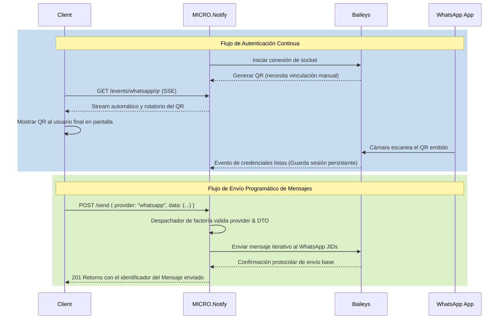

# Flujo de WhatsApp

Este documento describe cómo MICRO.Notify maneja la integración con WhatsApp a través del proveedor (adapter) internamente configurado.

## 1. Autenticación y Conexión (Auth Flow)

El microservicio utiliza la librería [Baileys](https://github.com/WhiskeySockets/Baileys) para conectarse a la API de WhatsApp mediante el protocolo Multi-Device (MD) simulando ser un dispositivo Web.

1. **Inicialización**: Al arrancar el servicio y levantar el módulo de notificaciones, se comprueba si existen credenciales previas almacenadas en el sistema (por ejemplo, en el volumen persistente).
2. **Generación de QR**: Si no hay una sesión activa, el adaptador comienza el proceso asíncrono y recibe eventos para generar códigos QR que permitan vincular un dispositivo.
3. **Escucha de QR**:
   - Los clientes pueden ver el último QR renderizado en formato HTML accediendo estáticamente a la ruta `GET /auth/qr`.
   - Para aplicaciones web/frontend (o integraciones de backend reactivas), se puede mantener una conexión persistente mediante Server-Sent Events (SSE) en `GET /events/whatsapp/qr` para recibir la actualización del código en tiempo real de forma responsiva y sin recargar, mientras este va rotando.
4. **Escaneo y Vinculación**: Una vez el usuario escanea el QR con su aplicación móvil principal de WhatsApp, el servicio guarda de forma segura las credenciales de la sesión en disco y el estado del servicio pasa internamente a **CONNECTED**.

> **Nota**: Los eventos del código QR se emiten tanto de forma interna a través del manejador global de estado (`ProviderStateService`) como de forma pública mediante los endpoints de visualización.

## 2. Envío de Mensajes (Send Flow)

El envío de notificaciones no se hace llamando de forma enlazada (hard-coded) al servicio de WhatsApp, sino a través del enrutador central de notificaciones `POST /send` cual delega de acuerdo al proveedor indicado en el request body.

1. **Recepción de la Petición**: El cliente hace un REST Http Request al microservicio a través de `POST /send` indicando explícitamente `provider: "whatsapp"` y un payload en el nodo estructural de `data` específico en su formato y tipado para este controlador emisor.
2. **Despacho (Dispatching)**: El controlador recibe el payload y el `NotificationDispatchService` identifica al vuelo que el destino del mensaje es WhatsApp.
3. **Inyección y Obtención**: Se obtiene internamente el puente con la sesión principal `WhatsappAdapter` utilizando la factoría generadora de proveedores `ProviderFactoryService`.
4. **Validaciones**:
   - Se validan los datos predeterminados en `data` (destinatarios presentados en el array `to` y el cuerpo estricto del `message`) usando los DTOs definidos de inyección como el `WhatsappSendDto`.
   - Se limpian y preparan los números telefónicos usando un sanitizer RegEx de solo-dígitos.
5. **Transmisión de Salida**: Luego el adaptador procesa e invoca la función de mensajería (a través de Baileys WA Socket) para ir entregando el texto directo a los identificadores remotos en formato puro y enlazado de WhatsApp (e.g., `123456789@s.whatsapp.net`).

## Diagrama del Flujo de Interacción

